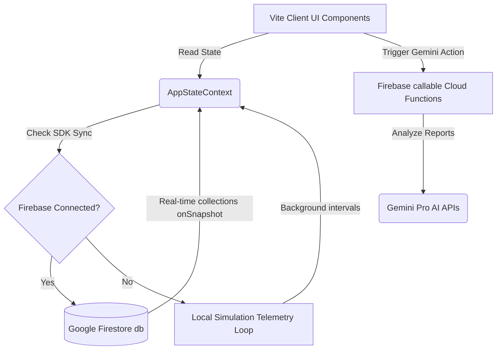

# System Architecture Guide

Welcome to the **StadiumGenie Real-Time Crowd Operations Platform** architecture guide. This document describes the modular component setup, directory layout, authentication boundaries, and telemetry data flow of the application.

---

## 1. Project Directory Layout

The codebase has been refactored into highly modular subcomponents to keep each source file readable, clean, and under the 200-line requirement.

```
D:/dinak/FIFA/
├── functions/              # Cloud Functions for Firebase (Gemini APIs, translation, reports)
├── scripts/                # Database seeding & setup scripts
├── src/
│   ├── components/         # Modular layout, forms, charts, and overlay components
│   │   ├── ActiveEventCard.jsx
│   │   ├── ActiveSopOverlay.jsx
│   │   ├── AuthSimulator.jsx
│   │   ├── ChatbotPanel.jsx
│   │   ├── EmergencyModal.jsx
│   │   ├── FacilityPanel.jsx
│   │   ├── FeedbackForm.jsx
│   │   ├── GatesStatsTable.jsx
│   │   ├── GatesStatusGrid.jsx
│   │   ├── IncidentForm.jsx
│   │   ├── IncidentQueue.jsx
│   │   ├── IngressChart.jsx
│   │   ├── NavigationWrapper.jsx
│   │   ├── QueueIndicator.jsx
│   │   ├── RoleSimulationWidget.jsx
│   │   ├── SidebarNavigation.jsx
│   │   ├── StadiumSvg.jsx
│   │   ├── StatCard.jsx
│   │   ├── SystemLogsView.jsx
│   │   ├── TaskDispatchList.jsx
│   │   ├── VolunteersChecklist.jsx
│   │   └── VolunteerSimulator.jsx
│   ├── context/
│   │   └── AppStateContext.jsx   # Global application telemetry & mock database simulation state
│   ├── hooks/
│   │   ├── useChatbotEngine.js   # Audio capture & askGenie NLP logic
│   │   ├── useEmergencyHandler.js# Incidents queue state machine hook
│   │   ├── useFirestoreCollection.js# Shared real-time Firestore listeners hook
│   │   ├── useOrganizerBriefing.js # AI Decision Support (DSS) generation hook
│   │   └── useRole.js            # Unified RBAC permission flags hook
│   ├── pages/
│   │   ├── AdminPanel.jsx        # Developer control logs and simulator profile configurations
│   │   ├── CrowdDashboard.jsx    # Real-time Recharts analytics and queue list
│   │   ├── FanAssistant.jsx      # Genie NLP assistant chat window and feedback
│   │   ├── Home.jsx              # App entry landing page
│   │   ├── OrganizerDashboard.jsx# Ingress profile control and DSS briefing panel
│   │   ├── StadiumMap.jsx        # Interactive vector layout directions map
│   │   └── StaffOperations.jsx   # Emergency queue dispatcher and active task board
│   ├── utils/
│   │   └── chatbotHelpers.js     # Fallback local synonym dictionary rules
│   ├── App.jsx
│   ├── index.css                 # Premium custom theme css system
│   └── main.jsx
├── ARCHITECTURE.md         # This documentation file
├── README.md               # User setup and testing strategy guide
└── package.json
```

---

## 2. Telemetry & Data Flow

The platform operates in a **dual-sync architecture** with automated fallbacks to keep operations fully functional under both online and offline simulation modes:



### Flow Details:
1. **State Access**: Page views query data via the `useAppState` hook.
2. **Persistence Layer**: Custom `useFirestoreCollection` hooks establish active Firestore onSnapshot subscriptions on mount. When Firebase credentials are not active, the hooks gracefully fallback to in-memory datasets.
3. **Gemini DSS Actions**: Features requiring text summaries, translation, or unstructured data classification dispatch callable HTTPS triggers directly. Local rule-based engines immediately resolve text prompts if network errors are encountered.

---

## 3. Role-Based Access Control (RBAC) Gating

The application routes and actions are gated by security roles configured via the **Admin Panel Simulator** and checked by the custom `useRole` hook:

| Security Role | Permissions Summary | Pages Accessible | Gated Controls |
|---|---|---|---|
| **Fan** | Anonymous guest access. View maps and submit feedback cards. | Home, Map, Assistant, Crowd | All configuration editors are disabled. |
| **Staff** | Emergency dispatcher. Clear incident queues and dispatch tasks. | Home, Map, Assistant, Crowd, Staff Ops | Acknowledge & resolve incidents, create new tasks. |
| **Organizer** | Event controller. Analyze DSS briefings and toggle gates. | Home, Map, Assistant, Crowd, Organizer | Toggle entry turnstile lock state profiles, trigger briefing events. |
| **Admin** | System developer. Override database configurations and seed mock collections. | All Pages | CRUD collections logs, full database seeder resets. |

---

## 4. Pathfinding Geometry & Congestion Rules

- **Curved Quadratic Bezier Pathfinding**: The `StadiumMap.jsx` pathfinder calculates mathematical concourse trajectories around the seating bowl utilizing:
  $$d = M(g_x, g_y) \ Q(c_x, c_y) \ (f_x, f_y)$$
  where the control node $(c_x, c_y)$ is mapped dynamically onto the concourse boundary ring relative to the angle of destination facility $(f_x, f_y)$.
- **Incident Escalation Rules**: The Standard Operating Procedures (SOP) rule engine matches incoming hazard tickets against preloaded severity thresholds:
  - If severity is **Critical** (e.g., Active Fire), the system sound overlays, alerts all active personnel, and locks down adjacent gate entries.
  - If load on a gate exceeds **80%**, the organizer dashboard flashes alerts recommending egress redirection profiles.
